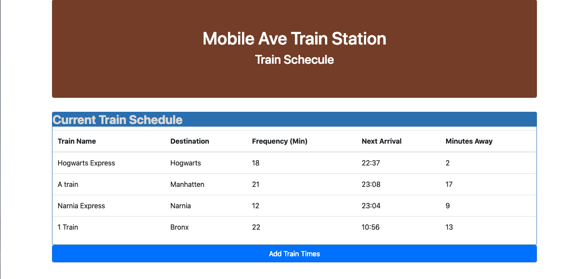
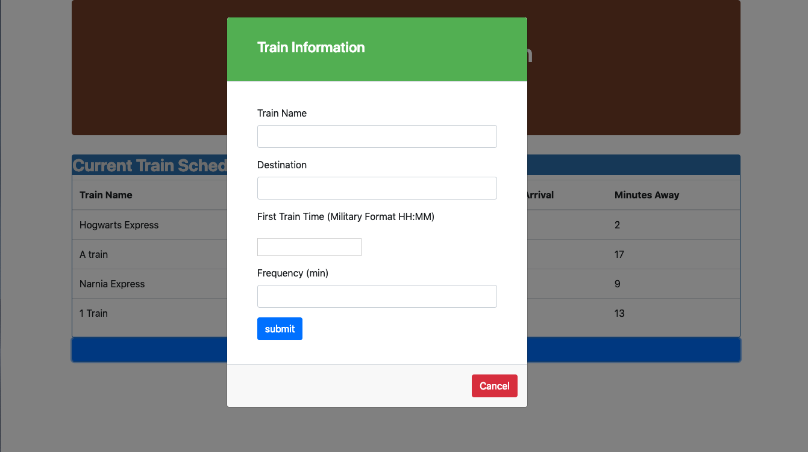
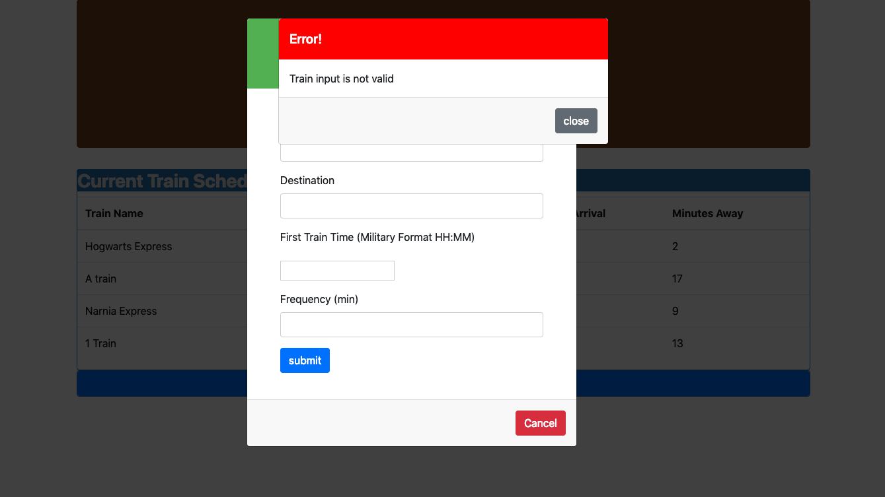

# train-scheduler
Week 7 assignment 

# Project Title

I have created a train schedule application that incorporates Firebase to host arrival and departure data. This app retrieves and manipulates this information with Moment.js. This website provides up-to-date information about various trains, namely their arrival times and how many minutes remain until they arrive at their station.

## Built With

* [Firebase](https://firebase.google.com/) - backend database used
* [bootstrap](https://getbootstrap.com/) 

## Screenshots

### The main page

### User Input Modal

### Error Modal

